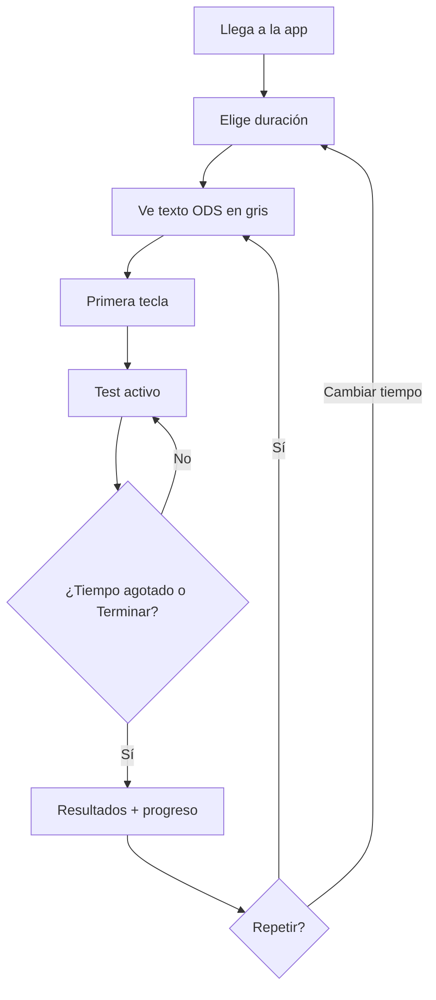

# ODS Typing — Especificación MVP

## 1. Visión del producto

**ODS Typing** es una aplicación web de mecanografía educativa que combina la práctica de escritura rápida con contenido sobre los **17 Objetivos de Desarrollo Sostenible (ODS)** de la ONU. El público objetivo son estudiantes que quieren mejorar su velocidad y precisión mientras aprenden conceptos clave de sostenibilidad.

**Referentes de UX:** Monkeytype (minimalismo, métricas en vivo, tipografía monoespaciada) y TypingClub (enfoque pedagógico, claridad visual).

---

## 2. Alcance del MVP

| Incluido | Excluido (futuro) |
|----------|-------------------|
| Una página principal con test de mecanografía | Cuentas de usuario / login |
| Textos dinámicos sobre ODS en español | Multijugador / rankings globales |
| 4 modos de tiempo (15s, 30s, 60s, infinito) | Teclado virtual |
| WPM, precisión, tiempo, errores | Idiomas adicionales |
| Tema claro / oscuro | Modos de palabras / citas personalizadas |
| Diseño responsive | Sincronización en la nube |
| Pantalla de resultados + progreso local | Certificados / gamificación avanzada |
| Repetir test | |

---

## 3. Requisitos funcionales

### RF-01 Página principal
- Cabecera con logo/nombre **ODS Typing** y subtítulo breve.
- Selector de duración visible antes y durante el test.
- Área central dominante para el texto a teclear.
- Barra de métricas en tiempo real.

### RF-02 Área de mecanografía
- Texto en español sobre un ODS aleatorio o rotatorio.
- Estados visuales por carácter: pendiente, actual, correcto, incorrecto.
- El test **inicia al pulsar la primera tecla** (no al cargar).
- Input oculto enfocado para capturar teclas; clic en el área reenfoca.
- Retroceso (`Backspace`) corrige el carácter anterior.
- En modos con tiempo: al llegar a 0 s se finaliza automáticamente.
- En modo infinito: el tiempo cuenta hacia arriba; el usuario puede **Terminar** o pulsar `Esc`.

### RF-03 Texto dinámico ODS
- Banco de fragmentos (2–4 oraciones) por cada uno de los 17 ODS.
- Al iniciar o repetir: selección aleatoria de un fragmento.
- Si el usuario completa el texto antes de que acabe el tiempo, se **concatena** otro fragmento aleatorio.

### RF-04 Temporizadores
| Modo | Comportamiento |
|------|----------------|
| 15 s | Cuenta atrás desde 15 |
| 30 s | Cuenta atrás desde 30 |
| 60 s | Cuenta atrás desde 60 |
| ∞ | Cuenta progresiva; sin límite |

### RF-05 Métricas
| Métrica | Definición |
|---------|------------|
| **WPM** | `(caracteres_correctos / 5) / minutos_transcurridos` (WPM neto) |
| **Accuracy** | `(caracteres_correctos / caracteres_tecleados) × 100` |
| **Tiempo** | Segundos transcurridos desde la primera tecla |
| **Errores** | Número de pulsaciones incorrectas (cada error suma 1) |

Actualización en tiempo real cada 100 ms durante el test activo.

### RF-06 Tema claro / oscuro
- Toggle manual en cabecera.
- Persistencia en `localStorage` (`ods-typing-theme`).
- Respeta `prefers-color-scheme` solo en la primera visita si no hay preferencia guardada.

### RF-07 Responsive
- **Móvil** (&lt;640px): métricas en grid 2×2, texto más pequeño, padding reducido.
- **Tablet** (640–1024px): layout intermedio.
- **Desktop** (&gt;1024px): ancho máximo ~900px centrado, tipografía grande estilo Monkeytype.

### RF-08 Pantalla de resultados
- Overlay o sección modal al finalizar con: WPM, accuracy, tiempo, errores.
- **Progreso:** mejor WPM histórico por modo de tiempo (almacenado en `localStorage`).
- Indicador si la sesión actual superó el récord.
- Botones: **Repetir** (mismo modo, nuevo texto) y **Cambiar tiempo** (vuelve a idle).

### RF-09 Repetir
- Reinicia estado del test, genera nuevo texto ODS, mantiene modo de tiempo y tema.

---

## 4. Requisitos no funcionales

- **Rendimiento:** 60 fps en animaciones CSS; sin librerías pesadas.
- **Accesibilidad:** `aria-label` en controles, contraste WCAG AA, foco visible.
- **Compatibilidad:** Chrome, Firefox, Safari, Edge (últimas 2 versiones).
- **SEO básico:** `lang="es"`, meta description en `index.html`.

---

## 5. Modelo de datos

### Estados del test
```
idle → active → finished
```

### `TypingStats` (sesión actual)
```ts
{
  correctChars: number;
  typedChars: number;
  errors: number;
  elapsedMs: number;
}
```

### `ProgressRecord` (localStorage)
```ts
{
  bestWpm: Record<'15' | '30' | '60' | 'infinite', number>;
  sessionsCompleted: number;
}
```

---

## 6. Diseño visual

### Paleta (inspiración Monkeytype)
| Token | Claro | Oscuro |
|-------|-------|--------|
| Fondo | `#f2f2f2` | `#323437` |
| Superficie | `#ffffff` | `#2c2e31` |
| Texto principal | `#646669` | `#d1d0c5` |
| Texto activo | `#2c2e31` | `#e2b714` |
| Correcto | `#2c2e31` / `#d1d0c5` | — |
| Error | `#ca4754` | `#ca4754` |
| Acento ODS | `#1a936f` | `#88d4ab` |

### Tipografía
- **UI:** Outfit (Google Fonts)
- **Test:** JetBrains Mono

### Espaciado
- Mucho margen vertical; contenido centrado.
- Sin bordes pesados; separación por espacio en blanco.

---

## 7. Flujos de usuario



---

## 8. Criterios de aceptación

1. ✅ Usuario puede completar un test de 30 s y ver WPM al finalizar.
2. ✅ Los errores se marcan en rojo y afectan accuracy.
3. ✅ El tema persiste al recargar la página.
4. ✅ La app es usable en viewport 375px de ancho.
5. ✅ El récord de WPM se actualiza y muestra en resultados.
6. ✅ `npm run build` compila sin errores.

---

## 9. Stack técnico

- React 19 + TypeScript
- Vite 8
- Tailwind CSS 4
- Sin backend; persistencia en `localStorage`
